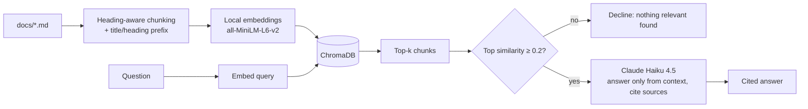

# Personal Knowledge Assistant

A command-line tool that answers questions about your own documents. Answers are grounded in the retrieved text and cite their source files, and the tool says so when the documents don't contain the answer.

I built it to learn LLM APIs, retrieval-augmented generation (RAG), and tool use, and I wrote an evaluation harness to measure design choices instead of guessing at them. The sample corpus is the READMEs of four of my own projects.

```
$ uv run personal-knowledge-assistant "How many images was the defect classifier trained on?"
The defect classifier was trained on 6,633 labeled casting images (3,758 defective and
2,875 acceptable) [Defect_Classifier.md #2].
```

## Features

- **Local embeddings and vector store.** `all-MiniLM-L6-v2` (sentence-transformers) and ChromaDB run on your machine. Only the final answer step calls an API.
- **Heading-aware chunking.** Markdown is split on headings (never inside code blocks), tiny sections are merged, long ones are split with overlap, and every chunk carries a `[Title / Heading]` prefix so it keeps its context.
- **Cited, grounded answers.** Claude Haiku 4.5 answers only from the retrieved excerpts, cites `[file #chunk]`, and declines when the excerpts don't answer the question.
- **Two modes.** A fixed retrieve-then-answer pipeline (default), and an optional tool-using agent that decides what to search for, can search one document at a time, and can rephrase and retry.
- **Evaluation harness.** A 35-question dev set and a 16-question holdout, with retrieval and answer-quality metrics, hand grading, and every run's results saved in the repo.

## Quick start

Requires [uv](https://docs.astral.sh/uv/) and an Anthropic API key.

```bash
git clone https://github.com/Hosam-Issa/Personal-Knowledge-Assistant
cd Personal-Knowledge-Assistant
uv sync
cp .env.example .env        # Windows: copy .env.example .env
# edit .env and set ANTHROPIC_API_KEY
uv run personal-knowledge-assistant
```

The first run downloads the embedding model (about 90 MB) and indexes the files in `docs/`. Put your own `.md` or `.txt` files there to ask about them. The eval sets refer to the sample READMEs, so they only apply to that corpus.

### Usage

```bash
uv run personal-knowledge-assistant                         # interactive session, pipeline mode
uv run personal-knowledge-assistant --agent                 # interactive session, agent mode
uv run personal-knowledge-assistant "What does the Pi monitor alert on?"   # one question, then exit
uv run personal-knowledge-assistant --reindex -v            # rebuild the index, show retrieval details
```

| flag | meaning |
|---|---|
| `--agent` | use the tool-using agent instead of the fixed pipeline |
| `-k N` | chunks retrieved per search (default 8) |
| `--docs PATH` | folder to index (default `docs`) |
| `--reindex` | clear the vector index and rebuild it |
| `-v` | show retrieved chunks and similarities (pipeline) or search queries (agent) |

## How it works



1. **Ingest.** Each document is split by headings into chunks of at most 800 characters (100 overlap when a section is split further), prefixed with its document and section title, embedded, and stored in ChromaDB with its source file and chunk number.
2. **Retrieve.** The question is embedded with the same model and the top-k chunks by cosine similarity are returned.
3. **Gate.** If even the best chunk is below a similarity of 0.2, the tool declines without calling the API.
4. **Generate.** The chunks, labeled `[file #chunk]`, go to the model with instructions to use only those excerpts, cite them, and say so when the answer isn't there.

**Agent mode** replaces steps 2 to 4 with a loop. The model gets a `search_documents(query, source)` tool, where `source` can restrict a search to one file, and may search several times (up to 5 steps) before answering. A verification step rejects any answer whose fenced shell commands don't appear word for word in the search results.

## Grounding, and why it reduces hallucination

A language model asked a question answers from what it memorized, and it can produce a confident, fluent, wrong answer. **Grounding** means constraining it to answer from supplied text instead. The assistant does this in layers:

- **Retrieval supplies the evidence**, so the model reads the relevant text instead of recalling it.
- **The prompt forbids outside facts** and tells the model to decline when the excerpts don't answer.
- **Citations make answers checkable.** Every claim points to a file and chunk you can open.
- **A similarity gate** avoids spending an API call (and risking a guess) when nothing relevant was retrieved.
- **Command verification (agent mode)** catches runnable commands that were not in the retrieved text. In testing, the agent once built `python bot/main.py` from a project-structure listing, when the documented command is `python -m bot.main`. The check blocked that answer.

This works but is imperfect. See the evaluation and limitations below.

## Evaluation

I wrote questions with known answers (and some with none) from the four READMEs, and measured retrieval and answer quality for each design change. The dev set (35 questions) was used to make decisions. The holdout (16 questions) was written after the settings were frozen and never tuned on. Answers were graded by hand against reference answers. Full tables and notes are in [`evals/results/SUMMARY.md`](evals/results/SUMMARY.md).

**Retrieval** (31 answerable dev questions; a hit means the expected text is in the top-k chunks):

| chunking | top-1 | top-3 | top-4 | top-8 |
|---|---|---|---|---|
| fixed 800-character chunks | 42% | 65% | 77% | 94% |
| heading-aware, fence-safe | 35% | 65% | 71% | 90% |
| + title/heading prefix (used) | 48% | 74% | 77% | 90% |

The prefix improved ranking but not recall. The plain 800-character chunker still has the best top-8.

**Answer quality** (hand-graded):

| system | dev set (35) | holdout (16) |
|---|---|---|
| pipeline, k=4 | 30/35 | n/a |
| pipeline, k=6 | 31/35 | n/a |
| pipeline, k=8 (default) | 33/35 | 14/16 |
| agent, k=8 | 33/35 and 32/35 (two runs) | 14/16 |

What I took from it:

- **Retrieval depth mattered most.** Going from 4 to 8 chunks added three correct answers, because the needed chunk was often ranked 5th to 8th.
- **The pipeline declined all four unanswerable dev questions at every k**, although the similarity gate blocked none of them. The prompt, not the threshold, did that work.
- **The agent tied the pipeline on accuracy at about twice the latency** (2.6 vs 1.4 seconds per question on the holdout, about 2.5 API calls per question instead of 1). It fixed some retrieval misses by rephrasing, but it sometimes presented a recommendation as fact (a "recommended editor" became "the IDE used") and speculated on unanswerable questions. So the pipeline is the default and the agent is opt-in.

Run the evals (the dev results are already saved in `evals/results/`):

```bash
uv run python -m evals.run_retrieval_eval <label>
uv run python -m evals.run_answer_eval <label> <k> [eval_path] [agent]
uv run python -m evals.grade <label>          # grade a run by hand
```

## Limitations

- **Small, hand-graded eval sets.** One question is about 3% of the dev set and 6% of the holdout, and grading is my own judgment. The holdout is a rough check, not a precise estimate.
- **Retrieval misses.** The "Run the bot" chunk of one README is rarely retrieved for "start"-style questions. A small embedding model matches on wording, and keyword search alongside embeddings would likely help.
- **The agent's similarity gate can reject valid short queries.** A search for "Raspberry Pi" in one document scored 0.196 against a 0.2 threshold and returned nothing. A fix (skipping the gate on single-document searches) is untested, and testing it would need a new holdout.
- **The command check covers fenced code blocks only.** A guessed command written in prose gets through.
- **The agent sometimes adds explanation that isn't in the documents.**
- **Questions that span projects can lose one**, especially when a topic is mentioned only in passing.
- **Plain text and Markdown only**, no PDFs, and no conversation memory: each question is answered independently.

## Project structure

```
docs/                          sample corpus: READMEs of four of my projects
src/personal_knowledge_assistant/
    main.py                    CLI entry point (--agent flag)
    rag.py                     chunking, embeddings, ChromaDB, retrieval, grounded answer
    agent.py                   tool-using agent with a search_documents tool
evals/
    eval_set.json              35 dev questions
    holdout_set.json           16 held-out questions
    run_retrieval_eval.py      top-k hit rate for retrieval
    run_answer_eval.py         end-to-end answers, pipeline or agent
    apply_grades.py, grade.py  record manual grades
    results/                   every run's output, plus SUMMARY.md
experiments/                   early scripts: prompt engineering, tool use, embeddings
```

## Tech stack

Python, [uv](https://docs.astral.sh/uv/), Anthropic API (Claude Haiku 4.5), ChromaDB, sentence-transformers (`all-MiniLM-L6-v2`), python-dotenv.